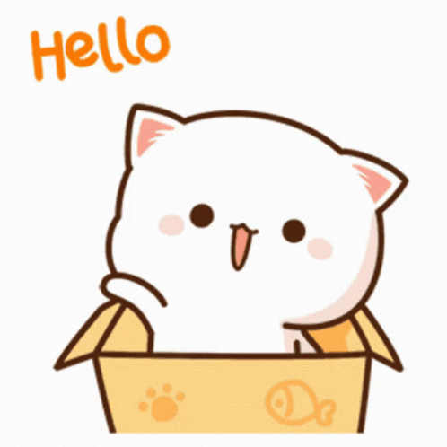

<div align="center">
  
</div>

<!-- ✨ Animasi Kucing Lucu ✨ -->
<div align="center">
  
</div>

###  Woylah, Welcome to My Coquette Code Era! 🎀💅

Bukan NPC, cuma seorang Front-End & Mobile Developer dari Ciamis yang lagi *grinding exp* di dunia nyata. Sering nulis *bug*, kadang nulis kode. *Skill issue*? Tinggal Googling abies 🗿. "Polyglot programmer - speaking fluent code in multiple languages" 🌐✨

<div align="center">
  <a href="https://regitaarr.github.io/portofolio/">
    
  </a>
  <a href="https://github.com/regitaarr">
    
  </a>
  <a href="https://linkedin.com/in/regitaarr">
    
  </a>
  <a href="mailto:workwithregita@gmail.com">
    
  </a>
  <br><br>
  
</div>

<div align="center">
  
</div>

### 🌸 [ FUN FACTS & PLAYER STATS ] 📊
- 🎓 **Class:** Fresh Graduate | S.Kom dari Universitas Teknologi Yogyakarta.
- 📍 **Base Camp:** Ciamis, Indonesia 🇮🇩
- 🗣 **Voice Lines:** Indonesian, English, Sundanese, Javanese (Multilingual *slayy* 💅).
- 🌱 **Current Buff:** Always learning new technologies and frameworks.
- 🎮 **AFK Status:** Push rank Mobile Legends (ID: `1275866107` — *let's play together fr fr*).

<br>

### 🎒 [ INVENTORY / TECH STACK ] 🛠️
*(Senjata andalan buat ngebantai error dengan gaya ✨)*

<div align="center">
  <a href="https://skillicons.dev">
    
  </a>
</div>

<br>

<table>
<tr>
<td width="33%">
<b>🐍 Python</b><br>

```python
def skills():
    return {
        "level": "Advanced",
        "projects": 4,
        "focus": ["Algorithms", "Data"]
    }

🎯 Projects:
🛍️ SISTEM SMTOWN APP (E-commerce)
📊 SITORSI-SDA (Inventory)
📋 GUI Program
🏢 Penerimaan Karyawan

HTML
<div class="web-stack">
    <span>HTML5</span> +
    <span>CSS3</span> +
    <span>JS</span> + <span>PHP</span>
</div>

🎯 Projects:
🎮 Rock Paper Scissors (Game)
🐍 Snake Game (Canvas)
🏬 SVT Store (Web)
💵 BayARRA! (POS system)

Dart
class MobileDev {
  String framework = "Flutter";
  String language = "Dart";
}

🎯 Projects:
✅ Smart Presensee (Face Recog)
🍜 Kawaii Ramen (App)
🛡️ SiKerja App (Safety)
💬 OTP Fonnte

🎮 [ MINI GAMES COLLECTION ] 🕹️
"Code is poetry, games are the rhythm" ✨

🎮 Games & Interactive: Snake Game, Rock Paper Scissors

🏢 Business Applications: Penerimaan Karyawan, SISTEM SMTOWN APP, Manajemen Data Toko, BayARRA! POS System

📱 Mobile Applications: Smart Presensee (Face-recognition Google ML Kit), Kawaii Ramen, SiKerja App, OTP Fonnte

🌐 Web Development: Feeding Oyon, Jennie Profile, YG Ent Profile, RW Hub, SVT Store, SIDAK Sinduadi

🔧 System & Utilities: SITORSI-SDA, GUI Program Data Structure

🎀 [ MY AESTHETIC VIBES ] 🎀
(Klik gambar untuk teleport ke Pinterest aku! ✨)

💖 [ GITHUB STATS / EXP BAR ] 📈
💫 [ CODE PHILOSOPHY ] 💭
JavaScript
const developer = {
    name: "regitaarr",
    motto: "Clean code, creative solutions 💅",
    approach: "Learn by building, improve by refactoring",
    goal: "Making technology accessible and aesthetic 🎀",
    quote: "Life is a game, code is the cheat code! 🎮✨"
};
console.log("Every line of code tells a story 📖✨");
